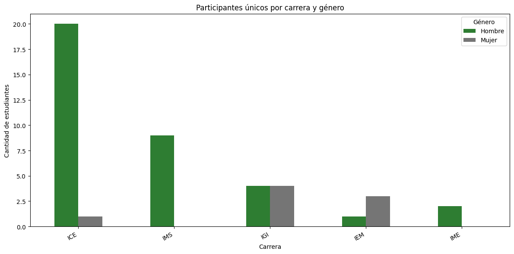
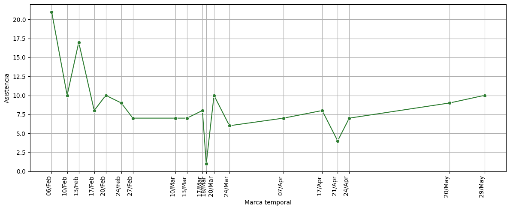
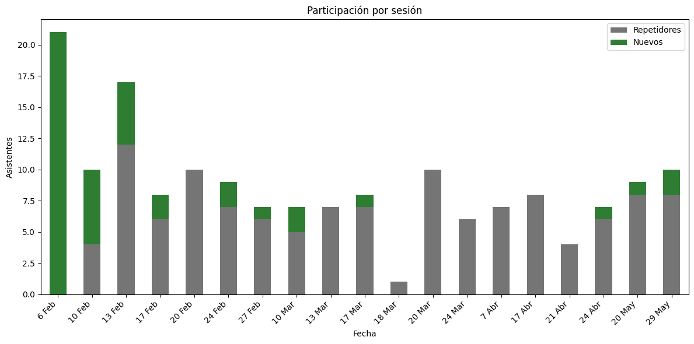
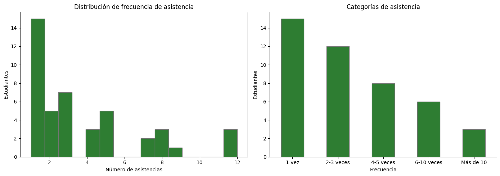
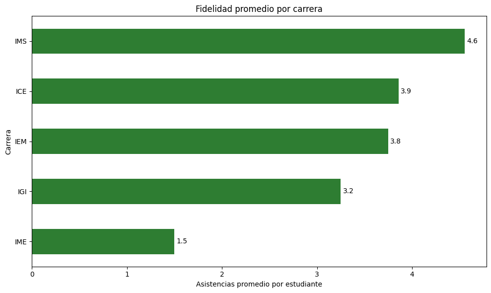
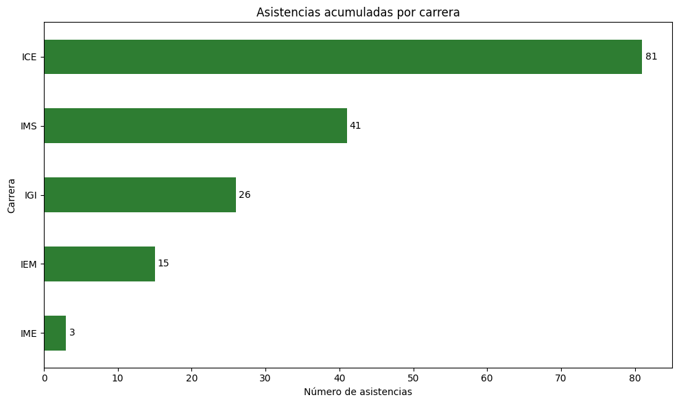
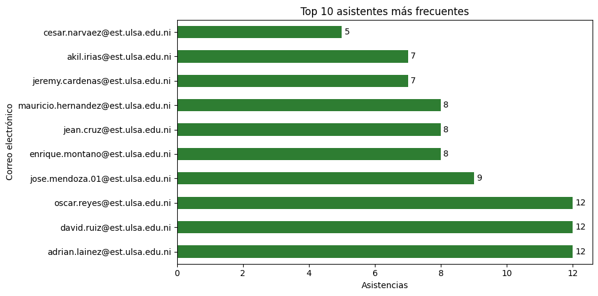
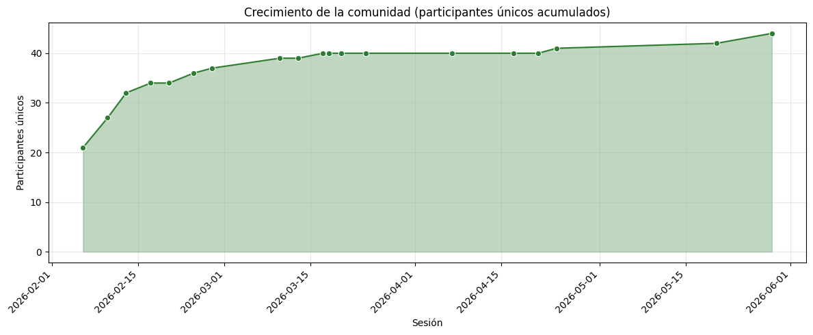

```{r setup, include=FALSE}
library(knitr)
opts_chunk$set(fig.path = "img/", echo = FALSE, warning = FALSE, message = FALSE)
```

<!-- ============================================================ -->
## Resumen ejecutivo
<!-- ============================================================ -->

Durante el periodo de análisis se registraron **166 asistencias** provenientes de **44 participantes únicos**, distribuidos en **19 sesiones**. El **65.9 %** de los participantes asistió a más de una sesión, lo que indica que el club no solo logró atraer estudiantes, sino también retenerlos.

Tres miembros —Adrián Laínez, David Ruiz y Oscar Reyes— asistieron a **12 de las 19 sesiones**, constituyendo el núcleo más comprometido. La carrera con mayor representación fue ICE (21 estudiantes), mientras que IMS presentó la fidelidad más alta (4.6 asistencias promedio por estudiante), sugiriendo perfiles diferenciados: ICE asociado a la continuidad organizativa del club, e IMS al núcleo de participantes activos incorporados durante el periodo.

<!-- ============================================================ -->
## Alcance
<!-- ============================================================ -->

### Total de registros y participantes únicos

| Indicador | Valor |
|-----------|-------|
| Total de registros (asistencias) | 166 |
| Participantes únicos | 44 |
| Periodo | feb 2026 — may 2026 |
| Sesiones realizadas | 19 |

### Participantes por carrera

```{r participantes-carrera}

```

ICE concentra la mayoría de los participantes (21 de 44), seguida de IMS (9), IGI (8), IEM (4) e IME (2). Hay un marcado desbalance de género: **36 hombres frente a 8 mujeres**.

La presencia de estudiantes de ICE puede estar asociada a la continuidad organizativa del club, dado que parte de su directiva y miembros históricos pertenecen a dicha carrera. Por otro lado, como se verá en las métricas de retención, la fidelidad observada en IMS sugiere que los estudiantes incorporados durante el periodo analizado han desarrollado un nivel elevado de compromiso y constituyen una parte importante del núcleo activo actual.

<!-- ============================================================ -->
## Asistencia por sesión
<!-- ============================================================ -->

```{r asistencia-dia}

```

La asistencia por sesión se mantuvo relativamente estable durante los meses activos, con picos puntuales que reflejan eventos de convocatoria especial. La gráfica muestra la evolución del flujo de participantes a lo largo del periodo.

```{r participacion-sesion}

```

La descomposición entre **nuevos** y **repetidores** por sesión revela una transición significativa: en las primeras sesiones predominan ampliamente los asistentes nuevos, mientras que a partir de la segunda mitad del periodo los repetidores comienzan a equiparar o superar a los nuevos. Este cambio de composición indica que el club está transitando desde una etapa de **captación** hacia una etapa de **consolidación** de la comunidad.

<!-- ============================================================ -->
## Métricas de retención
<!-- ============================================================ -->

### Frecuencia de asistencia individual

```{r frecuencia-asistencia}

```

| Categoría | Estudiantes | % |
|-----------|------------|---|
| 1 vez | 15 | 34.1 % |
| 2–3 veces | 12 | 27.3 % |
| 4–5 veces | 8 | 18.2 % |
| 6–10 veces | 6 | 13.6 % |
| Más de 10 veces | 3 | 6.8 % |

La media de asistencias por estudiante es de **3.8** y la mediana de **3.0**, lo que indica una distribución ligeramente asimétrica hacia la derecha: la mayoría asiste pocas veces, pero un grupo comprometido eleva el promedio.

**44 participantes únicos**, de los cuales **29 regresaron al menos una vez**, en **19 sesiones**, con **3 miembros en 12 sesiones**, describe el perfil de una **comunidad en formación**, donde una proporción importante de los estudiantes mantuvo una participación recurrente a lo largo de múltiples sesiones. Esto sugiere que las actividades del club no solo lograron atraer participantes nuevos, sino también consolidar un grupo estable de miembros activos.

### Coeficiente de retención

> **65.9 %** de los participantes que vinieron alguna vez regresaron al menos una segunda vez.

Esto significa que **29 de 44 estudiantes** volvieron después de su primera asistencia. Es una métrica clave para evaluar la capacidad del club de convertir visitantes en miembros recurrentes.

### Fidelidad por carrera

```{r fidelidad-carrera}

```

| Carrera | Asistencias promedio por estudiante |
|---------|-----------------------------------|
| IMS | 4.6 |
| ICE | 3.9 |
| IEM | 3.8 |
| IGI | 3.2 |
| IME | 1.5 |

IMS lidera en fidelidad con 4.6 asistencias promedio por estudiante, a pesar de tener menos participantes que ICE. Esto es coherente con la interpretación de que el núcleo estudiantil que se consolidó durante el periodo proviene principalmente de IMS, mientras que la presencia de ICE responde más a la continuidad organizativa.

### Asistencias acumuladas por carrera

```{r asistencias-acumuladas}

```

ICE acumula la mayor cantidad de asistencias totales, consistente con su mayor base de participantes.

### Top asistentes

```{r top-asistentes}

```

Tres estudiantes alcanzaron el máximo de **12 asistencias**: Adrián David Laínez Hernández, David Josué Ruiz Reyes y Oscar Francisco Reyes Guevara. Constituyen el núcleo más comprometido del club.

<!-- ============================================================ -->
## Crecimiento de la comunidad
<!-- ============================================================ -->

### Comunidad acumulada

```{r crecimiento-comunidad}

```

La curva de comunidad acumulada muestra el crecimiento del club a lo largo del periodo. El mayor crecimiento en participantes únicos se produjo durante las primeras sesiones, coincidiendo con la convocatoria inicial y con el evento del **6 de febrero de 2026**, que incorporó 21 nuevos miembros. Posteriormente, el crecimiento continuó a un ritmo más moderado mientras aumentaba la proporción de asistentes recurrentes, indicando una transición desde una etapa de **captación** hacia una etapa de **consolidación**.

### Crecimiento marginal

La sesión del **6 de febrero de 2026** registró la mayor captación de nuevos miembros (21), atribuible al inicio de las actividades del ciclo lectivo. A partir de entonces, la tasa de incorporación de nuevos participantes se estabilizó, reflejando el cambio de fase del club.

<!-- ============================================================ -->
## Hallazgos principales
<!-- ============================================================ -->

1. **Formación de comunidad activa**: 44 participantes únicos en 19 sesiones, con un coeficiente de retención del 65.9 %, describe el perfil de una comunidad estudiantil que está logrando consolidarse, no solo de eventos que atraen asistentes ocasionales. Las actividades del club no solo atrajeron participantes nuevos, sino que lograron que un grupo significativo mantuviera una asistencia recurrente a lo largo de múltiples sesiones.

2. **Dos perfiles por carrera diferenciados**: ICE concentra la mayor cantidad de participantes (21), lo cual se asocia a la continuidad organizativa del club (directiva y miembros históricos). IMS, con menos participantes (9), presenta la fidelidad más alta (4.6 asistencias promedio), sugiriendo que el núcleo de miembros activos incorporados durante este periodo proviene principalmente de esa carrera. Ambas lecturas son coherentes entre sí y con la operación del club.

3. **Transición de captación a consolidación**: El mayor crecimiento en participantes únicos ocurrió al inicio del periodo y durante la sesión del 6 de febrero de 2026. A partir de entonces, la tasa de nuevos ingresos se redujo mientras aumentaba la proporción de asistentes recurrentes. La gráfica de nuevos vs repetidores confirma visualmente este cambio de fase.

4. **Desbalance de género**: 36 hombres frente a 8 mujeres. Es un área de oportunidad para mejorar la inclusión en futuras convocatorias.

5. **Núcleo de alta fidelidad**: Tres miembros asistieron a 12 de 19 sesiones (63 %), y 9 estudiantes en total asistieron a más de 5 sesiones, confirmando la existencia de un grupo estable que sostiene la actividad del club.

> **Conclusión general**: Durante el periodo logró desarrollar un grupo estable de participantes recurrentes, con especial protagonismo de estudiantes de IMS en el núcleo activo actual y de estudiantes de ICE en la continuidad organizativa del club. Esta conclusión no surge únicamente de los datos ni únicamente de la experiencia operativa; surge de combinar ambas fuentes, que es justamente la ventaja de quien coordina el club y también analiza su información.
